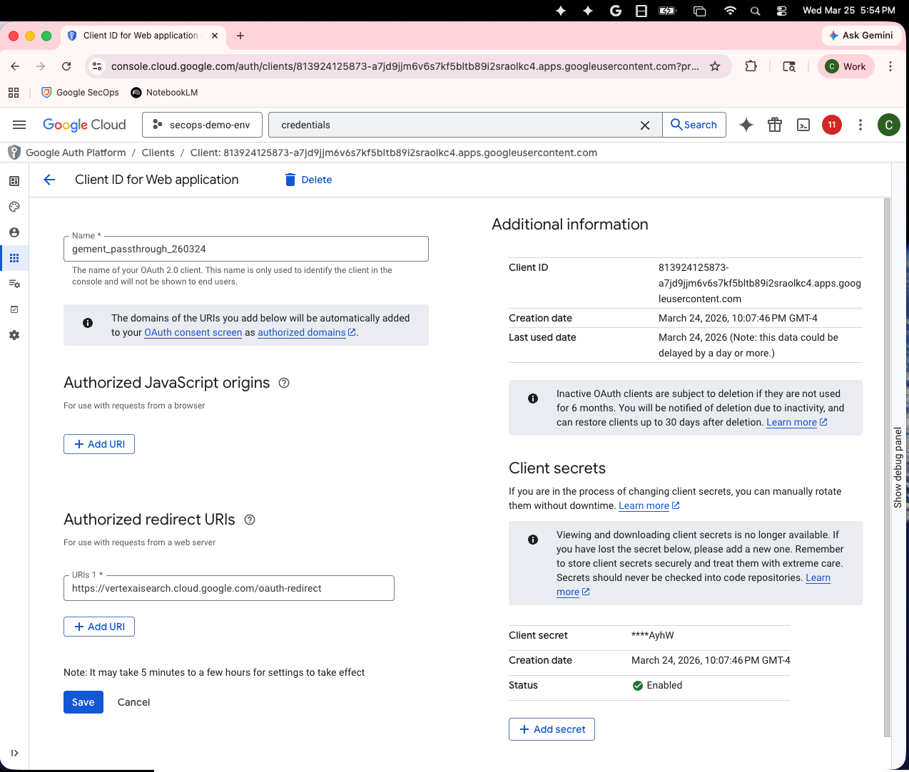

# Gemini Enterprise Agent Deployment

This guide outlines the bare minimum steps to successfully deploy and register a custom ADK agent that uses the [remote MCP server for SecOps](https://docs.cloud.google.com/chronicle/docs/secops/use-google-secops-mcp) in Vertex AI, setup OAuth, and integrate it with Gemini Enterprise. The goal is for OAuth passthrough to work seamlessly in Gemini Enterprise.

## High-Level Deployment Workflow

1. **Deploy Agent to Vertex AI Agent Engine**: Containerize and deploy your agent code to Vertex AI Reasoning Engine.
2. **Configure Local Environment**: Update your `.env` file with the newly generated Reasoning Engine ID.
3. **Generate GCP Client Secret**: Configure your GCP project and download the OAuth Web application client secret JSON.
4. **Setup OAuth Credentials**: Generate the local OAuth Authorization configuration properties using your client secret.
5. **Create OAuth Authorization**: Register the OAuth credentials with the Discovery Engine control plane.
6. **Create Gemini Enterprise App**: Initialize the application container within Gemini Enterprise.
7. **Register Agent with Enterprise**: Finalize the process by associating your Reasoning Engine to your Gemini Enterprise App.

OPTIONAL

8. Redeploying the Agent
9. Create a second (or third) Agent in the exact same application

---

## 1. Deploy Agent to Vertex AI
Deploy your agent code to Vertex AI Reason Engine. This command will execute a background deployment operation and inject necessary UI/Telemetry metadata natively.

Before running the command, ensure your `.env` file is populated with your specific tenancy variables:
```env
GCP_PROJECT_ID="your-project-id"
GCP_LOCATION="us-central1"
CHRONICLE_PROJECT_ID="your-chronicle-project-id"
CHRONICLE_CUSTOMER_ID="your-chronicle-customer-id"
CHRONICLE_REGION="us"

# Define a unique Auth ID here for your deployment. 
# (This is NOT generated from the OAuth flow, you simply invent an identifier string here and re-use it later in Step 5):
OAUTH_AUTH_ID="gement-onemcp-auth-passthrough-vX"
GEMINI_AUTHORIZATION_ID="gement-onemcp-auth-passthrough-vX"
```

```bash
python3 -m venv .venv
source .venv/bin/activate
pip install -r requirements.in
gcloud auth application-default login
python manage.py agent-engine deploy --agent-module agent
```

## 2. Configure Local Environment
**Important**: The deployment command above will print a Resource Name to the terminal (e.g., `projects/XXXXXXXXX/locations/us-central1/reasoningEngines/YYYYYYYYY`).
You **must** manually copy this Resource Name into your `.env` file before proceeding:

```env
AGENT_ENGINE_RESOURCE_NAME="projects/[PROJECT_NUMBER]/locations/us-central1/reasoningEngines/[ENGINE_ID]"
```

## 3. Generate GCP Client Secret
Before you can configure OAuth locally, you need an OAuth 2.0 Web Application client secret:
1. Navigate to **APIs & Services > Credentials** in the Google Cloud Console for your `GCP_PROJECT_ID`.
2. Click **Create Credentials > OAuth client ID**.
3. Select **Web application** (NOT Desktop or Mobile).
4. Under **Authorized redirect URIs**, add exactly: `https://vertexaisearch.cloud.google.com/oauth-redirect`
5. Click **Create** and download the resulting JSON file. 




*(Save this file securely on your machine, you'll need the path to it in the next step).*

## 4. Setup OAuth Credentials
Generate the Authorization URI and store the required credentials.

```bash
# Provide the path to the downloaded JSON file from Step 3:
export CLIENT_SECRET_JSON="path/to/client_secret.json"

python manage.py oauth setup $CLIENT_SECRET_JSON \
  --scopes "https://www.googleapis.com/auth/chronicle,https://www.googleapis.com/auth/cloud-platform,openid"
```

## 5. Create OAuth Authorization
Register the newly setup OAuth credentials with the Discovery Engine control plane.

```bash
export YOUR_OAUTH_AUTH_ID="gement-onemcp-auth-passthrough-vX"

python manage.py oauth create-auth --auth-id $YOUR_OAUTH_AUTH_ID
```

## 6. Create Gemini Enterprise App
Create the application container within the Gemini Enterprise platform.

```bash
python manage.py agentspace create-app \
  --name "SecOps Agent" \
  --app-type APP_TYPE_INTRANET \
  --industry-vertical GENERIC \
  --no-datastore
```

## 7. Register Agent with Enterprise
Associate your deployed Reasoning Engine (`AGENT_ENGINE_RESOURCE_NAME`) with your newly created Gemini Enterprise App.

```bash
export AGENT_ENGINE_ID="projects/[PROJECT_NUMBER]/locations/[LOCATION]/reasoningEngines/[ENGINE_ID]"
export APP_ID="[APP_ID]"

python manage.py agentspace register \
  --agent-engine-id $AGENT_ENGINE_ID \
  --app-id $APP_ID \
  --force
```

---

## OPTIONAL

### 8. Redeploying the Agent
If you make code changes to your agent locally, you **do not** need to rebuild the entire AgentSpace UX or OAuth integration! 
As long as your `.env` contains the existing `AGENT_ENGINE_RESOURCE_NAME` you populated in Step 2, you can just forcefully update the existing pipeline in-place:

```bash
python manage.py agent-engine update
```

### 9. Create a second (or third) Agent in the exact same application
If you want to deploy a brand new agent pipeline (via `agent-engine deploy` generating a new `$AGENT_ENGINE_ID`) but attach it to the exact same web UI drop-down as your previous assistant, you simply re-run the `register` command!

The Gemini Enterprise App container (Step 6) and OAuth definitions can safely host **multiple** assistants simultaneously. Just feed the registration endpoint the *new* engine ID alongside your *existing* App ID:

```bash
export NEW_AGENT_ENGINE_ID="projects/[PROJECT_NUMBER]/locations/[LOCATION]/reasoningEngines/[NEW_ENGINE_ID]"
export EXISTING_APP_ID="[EXISTING_APP_ID]"

python manage.py agentspace register \
  --agent-engine-id $NEW_AGENT_ENGINE_ID \
  --app-id $EXISTING_APP_ID \
  --force
```

---

## Utility Commands

### Enable ADK Console Metrics & Telemetry
The deployment script should automatically tag your engine for UI observability, but if you have an older deployment missing performance metrics or trace logs in the Cloud Console, you can manually fix it:

```bash
python manage.py agent-engine tag-as-adk
```

### Cleanup / Re-create OAuth
If you need to strictly delete an existing authorization before re-creating:

```bash
export YOUR_OAUTH_AUTH_ID="gement-onemcp-auth-passthrough-vX"

python installation_scripts/manage_oauth.py delete --auth-id $YOUR_OAUTH_AUTH_ID --force
```

### Deployment via Makefile
Alternatively, you can just use the Makefile for simplified task execution (after `.env` is updated):

```bash
make agent-engine-deploy
make oauth-setup CLIENT_SECRET=client_secret.json
make oauth-create-auth
make agentspace-create-app APP_NAME="My App"
make agentspace-register
```
